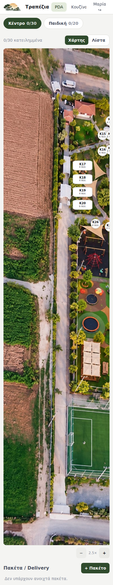
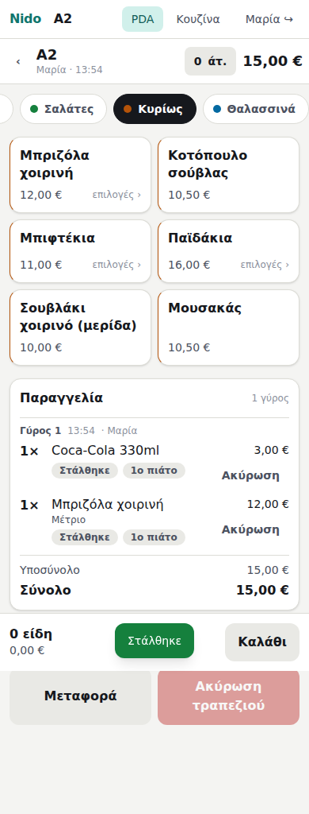
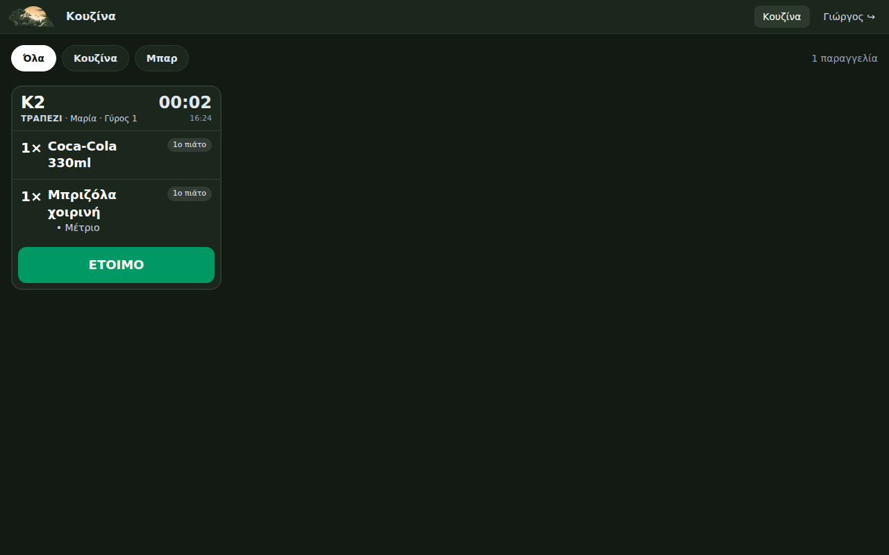
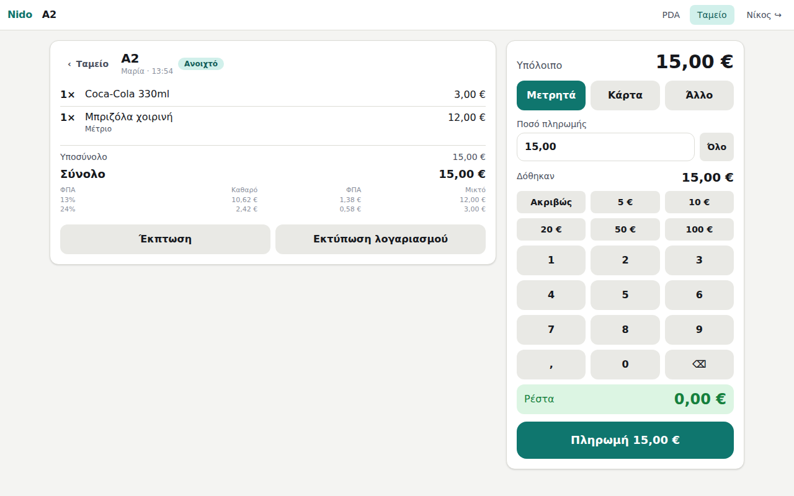
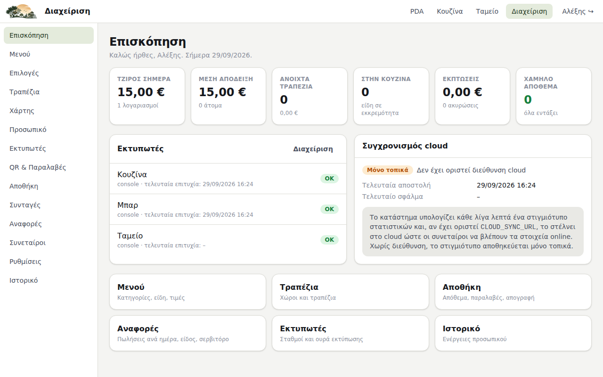
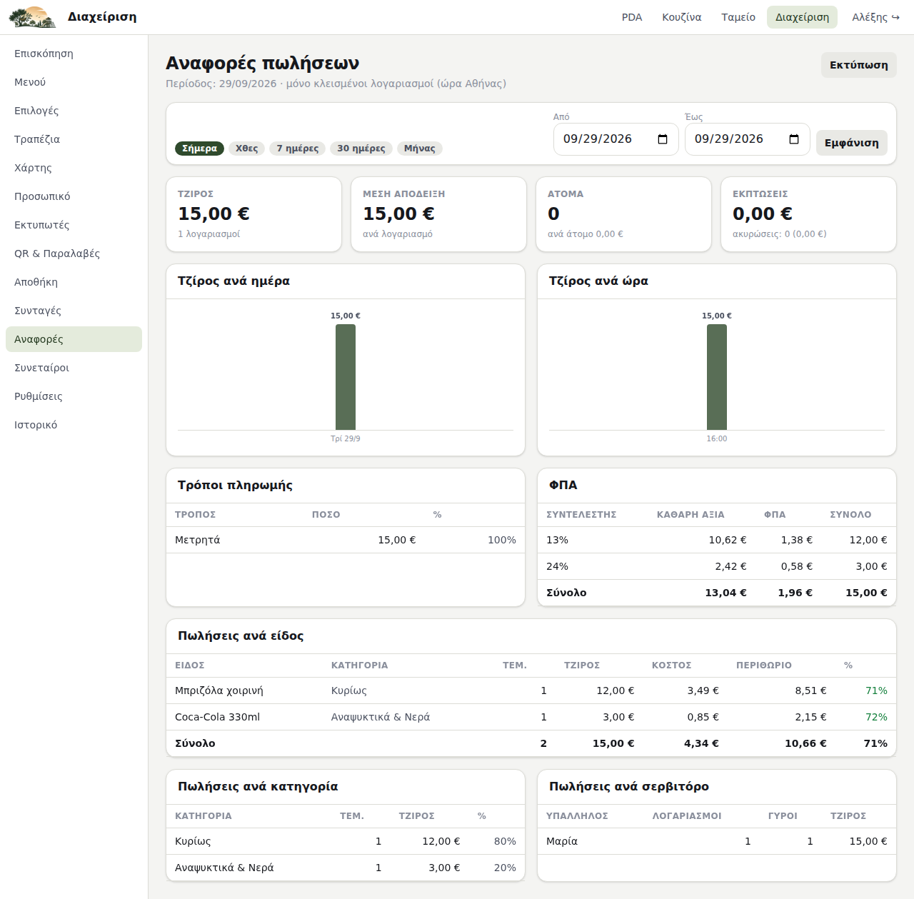
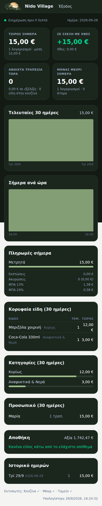

# Nido Village — Παραγγελιοληψία, PDA, Ταμείο, Αποθήκη

Λογισμικό εστίασης για το Nido Village: PDA σερβιτόρων, οθόνη/εκτυπωτές κουζίνας, ταμείο, αποθήκη με συνταγές, αναφορές, και online dashboard για τους συνεταίρους.

> **Νομική κατάσταση (Φάση 1):** το σύστημα **δεν εκδίδει αποδείξεις**. Μέχρι να συνδεθεί πιστοποιημένος πάροχος ΥΠΑΗΕΣ (ή ΦΗΜ εστιατορίου), η νόμιμη απόδειξη και το δελτίο παραγγελίας βγαίνουν από την υπάρχουσα ταμειακή. Το λογισμικό τρέχει **παράλληλα** με αυτήν. Η υποδοχή για τον πάροχο υπάρχει ήδη (`src/server/fiscal/provider.ts`) και κάθε παραγγελία/πληρωμή καταγράφεται ως παραστατικό που «θα έπρεπε» να εκδοθεί (`fiscal_documents`), ώστε η σύνδεση αργότερα να είναι μόνο υλοποίηση της διεπαφής. Δες [docs/ARCHITECTURE.md](docs/ARCHITECTURE.md) §2 για το τι απαιτεί η ΑΑΔΕ.

## Τι περιλαμβάνει

| Οθόνη | Διαδρομή | Ρόλοι |
|-------|----------|-------|
| Σύνδεση με PIN | `/login` | όλοι |
| PDA: κάτοψη, τραπέζια, πακέτα | `/pda` | σερβιτόρος και άνω |
| PDA: παραγγελία τραπεζιού (μενού, επιλογές, πιάτα, σημειώσεις, ακυρώσεις, λογαριασμός, μεταφορά) | `/pda/s/[id]` | σερβιτόρος και άνω |
| Οθόνη κουζίνας/μπαρ (KDS) ανά σταθμό, bump | `/kds` | όλοι |
| Ταμείο: ανοιχτοί λογαριασμοί, βάρδια ταμείου | `/cashier` | ταμίας και άνω |
| Ταμείο: λογαριασμός, έκπτωση, πληρωμή (μετρητά/κάρτα/split, ρέστα) | `/cashier/s/[id]` | ταμίας και άνω |
| Διαχείριση: επισκόπηση, μενού, επιλογές, τραπέζια, προσωπικό, εκτυπωτές & ουρά, αποθήκη (παραλαβές, φύρα, απογραφή, κινήσεις, προμηθευτές, κατανάλωση), συνταγές & κόστος, αναφορές, συνεταίροι, ρυθμίσεις, ιστορικό | `/admin/…` | υπεύθυνος/διαχειριστής |
| Χάρτης χώρου: σύρε τα τραπέζια πάνω στη φωτογραφία του χώρου, ανέβασε δική σου εικόνα, αυτόματη διάταξη | `/admin/floor` | υπεύθυνος/διαχειριστής |
| Παραγγελία πελάτη από QR (take away): μενού, καλάθι, όνομα/τηλέφωνο, κωδικός παραλαβής | `/order` | δημόσιο, χωρίς login |
| Σελίδα κατάστασης παραγγελίας: ζωντανή ενημέρωση, ειδοποίηση «έτοιμη για παραλαβή» | `/order/[token]` | δημόσιο (μόνο με το link) |
| Οθόνη παραλαβών για τηλεόραση στο ταμείο (ετοιμάζονται / έτοιμες) | `/pickup` | δημόσιο |
| QR για εκτύπωση και λίστα παραγγελιών QR | `/admin/qr` | υπεύθυνος/διαχειριστής |
| Online dashboard συνεταίρων (μόνο ανάγνωση) | `/partners` | χρήστες συνεταίρων (email/κωδικός) |

Λειτουργικά:

- **Εκτυπώσεις** ESC/POS σε εκτυπωτές δικτύου (IP:9100) με ελληνικά (CP737 / Windows-1253 / ISO 8859-7), QR, κόφτης, συρτάρι. Ουρά με επαναλήψεις και έλεγχο υγείας. Driver «console» για ανάπτυξη χωρίς εκτυπωτή.
- **Ζωντανή ενημέρωση** όλων των οθονών (SSE): η κουζίνα βλέπει την παραγγελία τη στιγμή που στέλνεται.
- **Αποθήκη**: συνταγές ανά είδος και ανά επιλογή (π.χ. «Extra φέτα»), αυτόματη αφαίρεση στην αποστολή παραγγελίας και επαναφορά στην ακύρωση, κινούμενος μέσος όρος κόστους, ειδοποίηση χαμηλού αποθέματος, περιθώριο ανά πιάτο.
- **Audit**: κάθε ακύρωση, έκπτωση, πληρωμή, παραλαβή, απογραφή καταγράφεται με χρήστη και αιτία.
- **Χάρτης χώρου**: τα τραπέζια έχουν θέση πάνω σε εικόνα (η αεροφωτογραφία του Nido Village είναι προφορτωμένη, με τους χώρους «Κέντρο» 30 τραπέζια και «Παιδική» 20). Το PDA δείχνει τον χάρτη με τα νούμερα και το χρώμα κατάστασης κάθε τραπεζιού.
- **Παραγγελία QR (take away)**: ο πελάτης σκανάρει το QR, παραγγέλνει από το κινητό του, παίρνει κωδικό παραλαβής (π.χ. #042) και μια σελίδα που ενημερώνεται ζωντανά. Όταν η κουζίνα πατήσει «ΕΤΟΙΜΟ», το κινητό του δονείται/ηχεί και του λέει να περάσει από το ταμείο. Η παραγγελία μπαίνει στην ίδια ροή με τις υπόλοιπες (κουζίνα, εκτυπωτές, απόθεμα, ταμείο, φορολογικό αργότερα). Πληρωμή στο ταμείο κατά την παραλαβή. Δεν στέλνει SMS (χρειάζεται πάροχο SMS με κόστος ανά μήνυμα, εύκολη προσθήκη αργότερα).
- **Cloud**: το κατάστημα στέλνει κάθε λεπτό ένα snapshot στατιστικών στο cloud. Οι συνεταίροι βλέπουν τζίρο ημέρας/μήνα/30 ημερών, ανά ώρα, είδη, κατηγορίες, προσωπικό, ανοιχτά τραπέζια, χαμηλά αποθέματα, ιστορικό ημερών.

## Εκκίνηση τοπικά (ανάπτυξη)

Απαιτείται Node.js 22.

```bash
npm install
npm run dev
```

Άνοιξε http://localhost:3000. Στην πρώτη εκκίνηση φορτώνονται δεδομένα επίδειξης (μενού, τραπέζια, πρώτες ύλες). PIN: **1234** διαχειριστής, **4444** υπεύθυνος, **2222** ταμίας, **1111** σερβιτόρος, **3333** κουζίνα.

Χωρίς `DATABASE_URL` η βάση είναι PGlite (ενσωματωμένη Postgres) στον φάκελο `.data/pglite`. Οι εκτυπωτές επίδειξης είναι τύπου «console»: η εκτύπωση εμφανίζεται στο τερματικό του server και στην προεπισκόπηση στο `/admin/printers`.

Έλεγχοι:

```bash
npm run typecheck
npm run lint
npm test
```

## Εγκατάσταση στο κατάστημα

Η αρχιτεκτονική είναι **local-first**: η εφαρμογή τρέχει σε ένα μικρό υπολογιστή στο κατάστημα (mini PC ή Raspberry Pi 5, με UPS) και οι συσκευές (PDA, tablet ταμείου, οθόνη κουζίνας) συνδέονται μέσω WiFi/LAN. Αν πέσει το internet, η παραγγελιοληψία και οι εκτυπώσεις συνεχίζουν κανονικά.

```bash
cp .env.example .env            # άλλαξε NIDO_SECRET και κωδικό βάσης
docker compose up -d --build
```

Μετά: `/admin/printers` για να δηλώσεις τους εκτυπωτές (driver `tcp`, IP, θύρα 9100, κωδικοσελίδα), «Δοκιμαστική εκτύπωση» για να ελέγξεις τα ελληνικά. Στα Android PDA άνοιξε τη διεύθυνση του box στον Chrome και «Προσθήκη στην αρχική οθόνη» (PWA).

Οδηγίες δικτύου: εκτυπωτές με καλώδιο Ethernet και στατική IP, όχι WiFi στην κουζίνα. Router με 4G backup.

## Cloud dashboard συνεταίρων

Δεύτερη εγκατάσταση της ίδιας εφαρμογής στο internet (π.χ. Vercel + Supabase Postgres) σε `NIDO_MODE=cloud`:

| Μεταβλητή | Cloud | Κατάστημα |
|-----------|-------|-----------|
| `NIDO_MODE` | `cloud` | `store` |
| `DATABASE_URL` | Supabase Postgres | τοπική Postgres (compose) ή κενό (PGlite) |
| `NIDO_SECRET` | τυχαίο, μακρύ | τυχαίο, μακρύ |
| `CLOUD_SYNC_KEY` | ίδιο κλειδί | ίδιο κλειδί |
| `CLOUD_SYNC_URL` | – | η διεύθυνση του cloud |
| `PARTNER_BOOTSTRAP_EMAIL` / `_PASSWORD` | ο πρώτος συνεταίρος | – |
| `NIDO_SEED_DEMO` | `0` | `1` μέχρι να περάσεις το μενού |

Το κατάστημα κάνει `POST /api/sync` στο cloud κάθε 60" και μετά από κάθε αλλαγή. Οι συνεταίροι συνδέονται στο `https://<cloud>/partners`. Επιπλέον χρήστες συνεταίρων δημιουργούνται από το `/admin/partners` της cloud εγκατάστασης.

Αν προτιμάς μία μόνο εγκατάσταση στο cloud (ταμείο και dashboard μαζί σε Supabase): δουλεύει, αλλά το ταμείο θα εξαρτάται από το internet και οι εκτυπώσεις χρειάζονται ένα τοπικό box έτσι κι αλλιώς. Δεν το προτείνω για την κουζίνα.

## Δομή κώδικα

```
src/db/            σχήμα (Drizzle), σύνδεση, seed
drizzle/           SQL migrations (εκτελούνται αυτόματα στην εκκίνηση)
src/server/
  services/        λογική: catalog, floor, ordering, billing, inventory, reports, staff, printers, settings, partners
  printing/        μοντέλο εισιτηρίου, ESC/POS, drivers, templates, ουρά
  fiscal/          διεπαφή παρόχου ΥΠΑΗΕΣ (Noop στη Φάση 1)
  cloud/           snapshot στατιστικών, publisher
  auth.ts          PIN login, JWT cookie
  events.ts        event bus + SSE
src/app/           οθόνες (login, pda, kds, cashier, admin, partners, api)
tests/             vitest (τρέχουν σε PGlite στη μνήμη)
```

## Τι ΔΕΝ κάνει ακόμη

- Δεν εκδίδει νόμιμα παραστατικά (χρειάζεται πάροχος ΥΠΑΗΕΣ, βλ. ARCHITECTURE §2.3).
- Δεν μιλά με τερματικά POS (η διασύνδεση Α.1155/2023 γίνεται μαζί με τον πάροχο).
- Δεν έχει offline λειτουργία στη συσκευή του σερβιτόρου: αν χαθεί το WiFi προς το box, η αποστολή αποτυγχάνει με μήνυμα και ξαναστέλνεται.
- Η παραγγελία QR δεν δέχεται online πληρωμή (κάρτα στο κινητό): θέλει ενσωμάτωση με πάροχο πληρωμών (Viva, Stripe) και συνδέεται με το φορολογικό κομμάτι. Πληρωμή στο ταμείο προς το παρόν.
- Δεν έχει κρατήσεις, κρατήσεις γηπέδου 5x5, πάρτι/εκδηλώσεις, loyalty, efood/Wolt.

## Screenshots

| PDA (κινητό) | Παραγγελία | Κουζίνα |
|---|---|---|
|  |  |  |

| Ταμείο | Διαχείριση | Αναφορές | Συνεταίροι |
|---|---|---|---|
|  |  |  |  |

## End-to-end έλεγχος

Με τρέχοντα server (και έναν χρήστη συνεταίρου, π.χ. μέσω `PARTNER_BOOTSTRAP_EMAIL`/`PARTNER_BOOTSTRAP_PASSWORD`):

```bash
BASE=http://localhost:3000 PARTNER_EMAIL=partner@nido.test PARTNER_PASSWORD=partner123 node scripts/e2e-smoke.mjs
```

Κάνει login ως σερβιτόρος, στέλνει παραγγελία, την ετοιμάζει η κουζίνα, την εισπράττει το ταμείο, ανοίγει όλες τις σελίδες διαχείρισης και το dashboard συνεταίρων, και αποθηκεύει screenshots στον φάκελο `screenshots/`.
